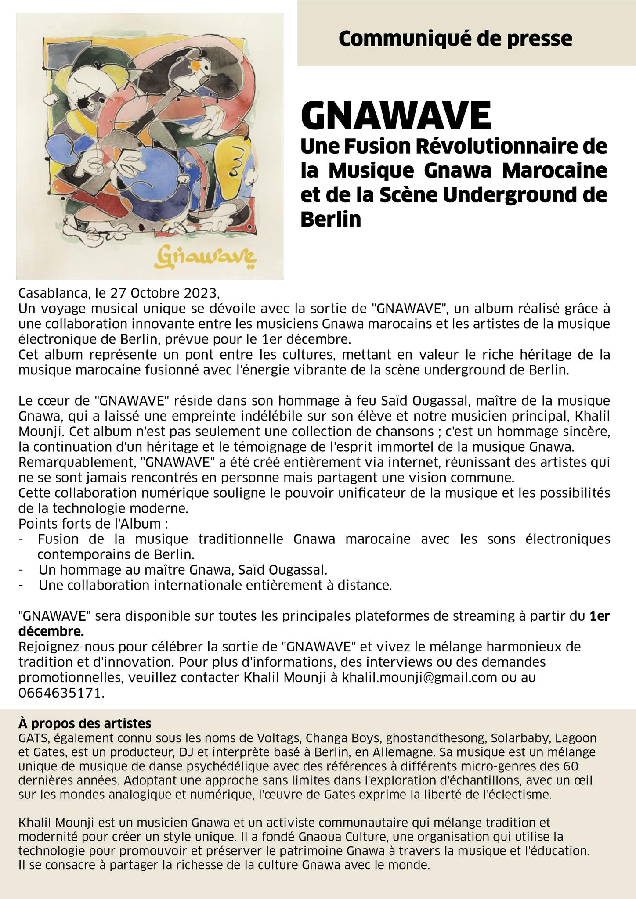

# **Gnawave Project Overview** 🌍🎵

For a concise summary, see the [One-Pager](./one-pager.html).

For a German version, see [Gnawave Projektübersicht](./index-de.html).

## **Table of Contents** 📚

- [Introduction](#introduction)
- [Collaborative Objectives](#collaborative-objectives)
  - [Open-Source Dataset and Musical Data Visualizations](#open-source-dataset-and-musical-data-visualizations)
  - [Music Release](#music-release)
  - [Collaborative Live Performance](#collaborative-live-performance)
- [Project Todo List](#project-todo-list)
- [Participants and Partners](#participants-and-partners)
- [Artists and Collaborators](#artists-and-collaborators)
  - [Gats (Matthias Kanik)](#gats-matthias-kanik)
  - [Khalil Mounji](#khalil-mounji)
  - [Saeko Okuchi (Saeko Killy)](#saeko-okuchi-saeko-killy)
- [Gnawave Release Highlights](#gnawave-release-highlights)
- [Institutional Engagement and Support](#institutional-engagement-and-support)



The **Gnawave Project** is an *interdisciplinary initiative* that combines the **unique rhythms** of *Gnawa music* with the **creative applications** of *artificial intelligence*. This project aims to preserve important cultural heritage while expanding the boundaries of AI in music. The residency phase starts on Thu, Jun 13, 2024, and concludes with the Essaouira Festival from Thu, Jun 27, 2024 – Sat, Jun 29, 2024.

## **Collaborative Objectives** 🎯



## **Gnawa music from current AI Models**



## **Project Todo List** ✅

- [x] Create first draft of website
- [ ] First contact with potential institutions (*Goethe Institut*)
- [ ] Add artist / collaborators section to the website



## **Gnawave Release** 🌟 - December 1, 2023

The "**Gnawave**" release, dated December 1, 2023, showcases the project's achievements by merging Gnawa music with electronic elements from Berlin's underground scene. This album pays tribute to *Maallem Said Benthami Oughassal*'s legacy and supports his family, reflecting the project's commitment to community and cultural sustainability.

<iframe width="512px" height="300" scrolling="no" frameborder="no" allow="autoplay" src="https://w.soundcloud.com/player/?url=https%3A//api.soundcloud.com/playlists/1729743579&color=%23ff5500&auto_play=false&hide_related=false&show_comments=false&show_user=false&show_reposts=false&show_teaser=false&visual=true"></iframe>
<a href="https://soundcloud.com/g-a-t-s" title="Gats" target="_blank" style="color: #cccccc; text-decoration: none;">Gats</a> · <a href="https://soundcloud.com/g-a-t-s/sets/gnawave" title="Gnawave" target="_blank" style="color: #cccccc; text-decoration: none;">Gnawave on SoundCloud</a>

[{:width="256px"}](media/gnawave release.jpeg)

## **Institutional Engagement and Support** 🏛️



## **Contact for Partnership Opportunities and Support** 📧

For partnership opportunities and support, please reach out to:

- **Khalil Mounji**: `khalil.mounji[at]gmail[dot]com`
- **Thomas H**: `thomash[at]pollinations[dot]ai` or via phone at `+49 one seven five four eight six three two four six`.